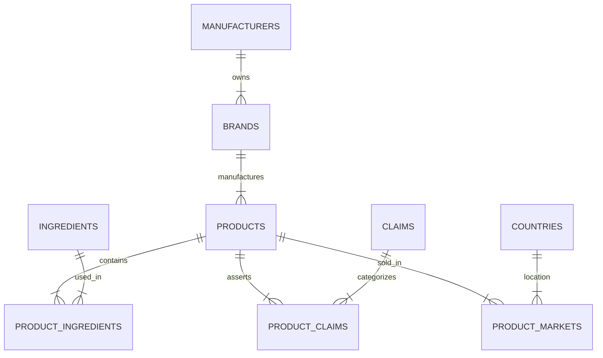

# ⭐ OralAtlas 2026

An open, research-grade relational dataset of global oral care products collected from official manufacturer sources.

- **194 curated product records**
- **30 brands**
- **17 manufacturers**
- **62 unique active ingredients**
- **12 countries/regions**
- **100% official-source derived**
- **15 normalized relational tables**
- **SQLite + Parquet + CSV**
- **Knowledge Graph Ready**
- **Machine Learning Ready**
- **Research Ready**

---

## Abstract
The Global Oral Care Products Intelligence Dataset (GOPID) 2026, colloquially known as **OralAtlas 2026**, is a standardized, research-grade knowledge base of oral care products globally. Unlike conventional commercial datasets, OralAtlas goes beyond simple product lists by providing a meticulously curated, relational ontology connecting products, manufacturers, standardized ingredients, therapeutic properties, certifications, sustainability indicators, formulation chemistry, and consumer-facing claims. This dataset aims to support advanced scientific analysis, market intelligence, public health research, and machine learning applications within the dental consumer product space.

## Motivation
The oral care market is vast and chemically complex, yet publicly available data is fragmented, non-standardized, and heavily skewed by marketing terminology rather than scientific nomenclature. Researchers, health professionals, and machine learning practitioners lack a cohesive resource to analyze global trends in formulations (e.g., fluoride vs. non-fluoride, prevalence of nano-hydroxyapatite), evaluate sustainability claims against packaging reality, or track the network of parent companies and their subsidiary brands. 

### Why OralAtlas Exists
OralAtlas was conceived to bridge this gap, prioritizing data quality, provenance, and structured ontology over sheer volume. By normalizing raw data into a strictly typed relational format, it enables deep programmatic querying and AI/ML model training right out of the box.

---

## Schema Overview

The dataset is fully normalized. Below is the Entity-Relationship (ER) Architecture mapping how Products relate to their respective Brands, Ingredients, and Claims:



### Folder Structure
```text
OralAtlas-2026/
├── exports/
│   ├── oralatlas.db (SQLite Database)
│   ├── *.parquet (Optimized analytical files)
│   └── *.json
├── raw_data/
│   └── verified/ (Strictly controlled official source ingestion drops)
├── docs/ (Methodology & Data Dictionary)
├── notebooks/ (Polished EDA insights)
├── schemas/ (JSON Ingestion contracts)
└── pipeline.py (The automated CI/CD ETL script)
```

---

## Data Collection Methodology
Data is collected exclusively from official manufacturer sources (e.g., Colgate, Crest, Sensodyne). Every single data drop entering the `raw_data/verified/` folder is strictly typed according to `schemas/ingestion_schema.json` to ensure consistency. 

## Validation Process
OralAtlas operates like a software project. We utilize a CI testing pipeline (`pytest tests/`) and a rigorous validator (`src/oralatlas/validator.py`) that strictly checks for:
- Duplicate products and ingredients.
- Broken foreign keys across the relational mapping.
- Logically sound fluoride ppm ranges and currency constraints.

## Limitations
- **Temporal Validity:** Formulation changes by manufacturers may occur without public notice. Our `version_history.csv` tracks major audits.
- **Market Coverage:** The dataset initially prioritizes major global brands; regional or indie brands may be underrepresented in early versions.

---

## Version History & Roadmap

We treat OralAtlas like an evolving open-source project. 

- ✅ **v1.0** — 194 curated product records collected from official manufacturer sources.
- 🚀 **v1.1** — Expansion to 500 products
- 🚀 **v1.2** — Expansion to Mouthwash
- 🚀 **v1.3** — Dental floss additions
- 🚀 **v2.0** — Electric toothbrushes
- 🚀 **v2.5** — Interactive Streamlit Dashboard
- 🚀 **v3.0** — Knowledge graph + Public API

## Citation
If you use this dataset in your research, please cite:
> Kishore, Lalit. (2026). *OralAtlas 2026: Global Dental Products Database*. Kaggle. https://www.kaggle.com/datasets/lalitkishorer/global-dental-products-database-verified

## License
This project is licensed under the Creative Commons Attribution 4.0 International (CC BY 4.0).
